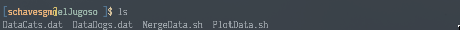

## book

**book** is a manual version control program written in Python.
It allows you to add notes to different files in one directory.

Imagine you had a folder full of files, maybe because you need to
analyse different data using multiple scripts. **book*** allows you
to add comments to those files from the command line by parsing
some tags. You can fully manage your files, from appending comments
to adding new files and removing lines of comments.

# A simple tutorial.

Imagine we had the following folder,

*DataDogs.dat* needs to be merged with *DataCats.dat* in order using
the script named *MergeData.dat*. After that, we do need to
plot all the data using *PlotData.dat*. Moreover, we have found
an error in *DataDogs.dat*, the *CORGI* section has a type that
will lead to a bug in your merging process. We *DO* have to
solve it. In addition, we would also like to plot *DataDogs.dat*
by itself to see a beautiful plot.

We have to do a lot of stuff... Me, as a human, I tend to forget
about things, even the notebook. That's why I decided to create
**book***. Now you are able to add those notes to the files in the same
terminal you use to work. Let's see how it works.

First of all, we can call **book*** to provide us some hints about
how to use it...

Let's start by adding a comment to *DataDogs.dat* stating that
we would like to correct the error in corgi data type. Let's add
the file to **book** and then append a comment to it,

