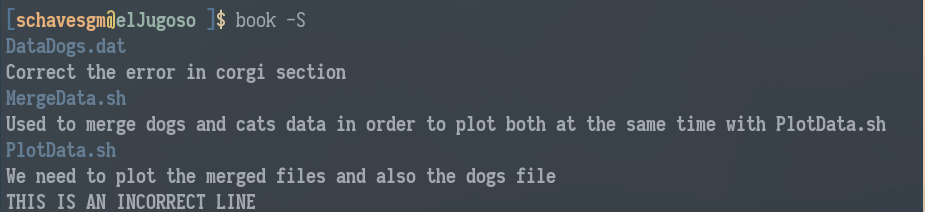

## book

**book** is a manual version control program written in Python.
It allows you to add notes to different files in one directory.

Imagine you had a folder full of files, maybe because you need to
analyse different data using multiple scripts. **book*** allows you
to add comments to those files from the command line by parsing
some tags. You can fully manage your files, from appending comments
to adding new files and removing lines of comments.

# A simple tutorial.

Imagine we had the following folder,

*DataDogs.dat* needs to be merged with *DataCats.dat* in order using
the script named *MergeData.dat*. After that, we do need to
plot all the data using *PlotData.dat*. Moreover, we have found
an error in *DataDogs.dat*, the *CORGI* section has a type that
will lead to a bug in your merging process. We *DO* have to
solve it. In addition, we would also like to plot *DataDogs.dat*
by itself to see a beautiful plot.

We have to do a lot of stuff... Me, as a human, I tend to forget
about things, even the notebook. That's why I decided to create
**book***. Now you are able to add those notes to the files in the same
terminal you use to work. Let's see how it works.

First of all, we can call **book*** to provide us some hints about
how to use it...

Let's start by adding a comment to *DataDogs.dat* stating that
we would like to correct the error in corgi data type. Let's add
the file to **book** and then append a comment to it,

We can use the command **book -S** to show all the comments and
files contained in our folder. Let's try appending two more comments
to the other files. To do so, we need to add files using the tag **-A**
and then append comments to them using **-i nameFile -a Comment**.

Oh!! As you can see, there is an **INCORRECT** line. Let's try deleting
that line using the tag **-d**. We can use this tag in two ways, the
first one requires providing the line number of the comment to delete.
For each file, the lines go from zero to N-1. In our case, the file
*PlotData.sh* has two comments, the one we would like to delete is
the line number 1. We can also use the delete tag providing a substring,
in case this string is contained in any of the lines in the file, it will
delete it. NOTE that if the string provided is contained in more than one
line, it will delete all the matched lines. Let's delete that ugly comment.

After this, we are ready to do our job. Imagine we finish our tasks and we
do want to delete everything related to a specific file. In order to do so
we might want to use the tag **-r**. This tag will remove everything attached
to a file. Let's delete everything related to the file *PlotData.dat*.

